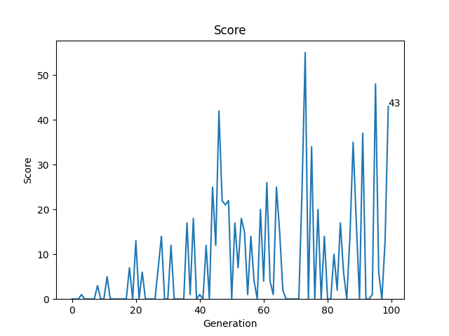
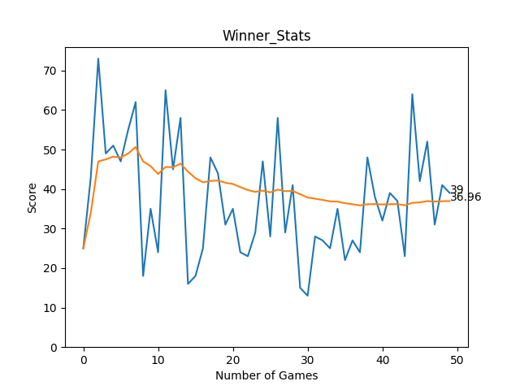

# Even Semester Project - AI Learns To Play Snake

## Description
This project demonstrates two different approaches to creating an AI for the classic Snake game:
1. **NEAT**: NeuroEvolution of Augmenting Topologies, a genetic algorithm for evolving neural networks.
2. **Q-Learning**: A model-free reinforcement learning algorithm.

For both projects, I have used `Python 3.12.1` , although similar versions should work

# Snake - NEAT
## How to run

Check the `NEAT-Snake_Game` folder for all required files.

### Install dependencies
    pip install -r requirements.txt
### Other files required
#### helper.py
- Used to plot Score and Mean Score of the Winner AI by the number of games it has been running for.
#### config-feedforward.txt
- This is used by neat-python library to configure parameters for the NEAT algorithm. Contains various sections for setting up the neural network, evolution process and more.
## Run the code
    python snake_v2.py

### While running the code you will see two different displays of the snake game.
1) This is showing the training process, upto 120 generations. To adjust the frame rate, uncomment : `clock.tick(50)` in `run_game(genomes,config)`
2) A plot shows the score vs no. of generations

   
3) This runs the best neural network again and displays those games. To adjust the frame rate, uncomment : `clock.tick(50)` in `test_winner(winner,n)`

    
4) Lastly a plot is made showing the score and mean score of the winner AI across the number of games it played again.

   Blue : Score
   
   Orange : Average Score
 
# Fitness Function
    SnakeLength
  SnakeLength = Number of fruits it ate
  - Fitness is reduced by 10 if the snake dies, or if the Number of frames that snake has existed for exceeds 100, while its length is less than 5.

# Vision inputs
## This give the snake's neural network a sense of its environment.

 These inputs are:
 
  1. `dirSnack[0]`:Indicates whether the snack is directly ahead.
  
  2. `dirSnack[1]`: Indicates whether the snack is to the left.

  3. `dirSnack[2]`: Indicates whether the snack is to the right.

  4. `dist[0]`: Distance to the nearest obstacle (wall or body) directly ahead.

  5. `dist[1]`: Distance to the nearest obstacle (wall or body) to the left.

  6. `dist[2]`: Distance to the nearest obstacle (wall or body) to the right.

# Vision outputs
`0` : Turn left

`1` : Turn right

`2`: Keep forward

## The winning model is stored as a pickle file ```winner.pkl```

# Snake- Q Learning
## How to Run
Check the `Q-Learning_SnakeGame` folder for all required files

### Install dependencies
        pip install -r requirements.txt

#### helper.py
- Used to plot Score and Mean Score of the AI while it is training.
### model.py
- Defines 2 classes `Linear_QNet` and `QTrainer` for training a Deep Q Learning Network.
### `Linear_QNet`
- **Purpose**: Implements a simple feedforward neural network with one hidden layer.
- **Constructor Parameters**:
  - `input_size` (int): The number of input features.
  - `hidden_size` (int): The number of neurons in the hidden layer.
  - `output_size` (int): The number of output features.
- **Methods**:
  - `forward(x)`: Defines the forward pass of the network, applying ReLU activation to the hidden layer and producing the output.
  - `save(file_name='model.pth')`: Saves the model's state dictionary to a specified file path.

### `QTrainer`
- **Purpose**: Manages the training process for the Q-network, handling the optimization and loss calculation.
- **Constructor Parameters**:
  - `model` (Linear_QNet): The neural network model to be trained.
  - `lr` (float): Learning rate for the optimizer.
  - `gamma` (float): Discount factor for future rewards.
- **Methods**:
  - `train_step(state, action, reward, next_state, done)`: Performs a single training step, updating the Q-values based on the given batch of state transitions. This method:
    - Converts inputs to tensors.
    - Predicts Q-values for the current state.
    - Calculates target Q-values using the Bellman equation.
    - Computes the loss and performs backpropagation to update the model weights.

### snake_game_RL_v2.py
Contains the structure of the snake game and displays each game using pygame.

To decrease frame rate, uncomment : `clock.tick(50)` in the `def move(self,action)` method in the Snake Class.
- It gives +10 reward for eating fruit, -10 reward for dying and 0 reward for moving one step with nothing happening.
  
## Run the file
`agent_v2.py`

- You will see 2 screens, one running the snake game and the other shows a plot of the AI's performance as it is trained after each game.
### `get_state` Function Return Value

The `get_state` function returns a NumPy array representing the current state of the snake game. The state consists of several boolean values indicating the presence of danger, the direction of the snake's movement, and the relative position of the food. The state is structured as follows:

1. **Danger Detection**:
   - `danger_f` (boolean): True if there is a danger (such as a wall or the snake's own body) in front of the snake.
   - `danger_r` (boolean): True if there is a danger to the right of the snake.
   - `danger_l` (boolean): True if there is a danger to the left of the snake.

2. **Movement Direction**:
   - `dir_l` (boolean): True if the snake is currently moving left.
   - `dir_r` (boolean): True if the snake is currently moving right.
   - `dir_u` (boolean): True if the snake is currently moving up.
   - `dir_d` (boolean): True if the snake is currently moving down.

3. **Food Location Relative to the Snake's Head**:
   - `food_left` (boolean): True if the food is to the left of the snake's head.
   - `food_right` (boolean): True if the food is to the right of the snake's head.
   - `food_up` (boolean): True if the food is above the snake's head.
   - `food_down` (boolean): True if the food is below the snake's head.

These values are combined into a single NumPy array of integers, with each element representing a specific aspect of the game state.

### Vision outputs
`0` : Turn left

`1` : Turn right

`2`: Keep forward

## The model with the greatest score is saved as a pytorch file : `model.pth`
